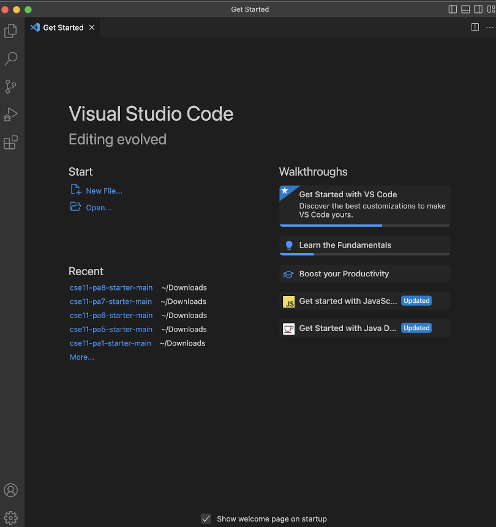
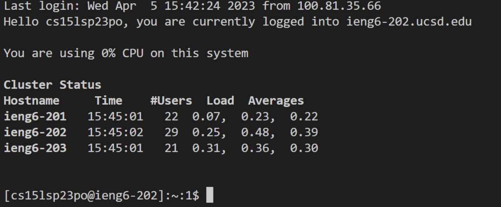

# Lab Report 1

Hello!! Welcome to the beginning of the CSE15l journey. Here we are going to learn how to setup your computer. By the end of this report you will know how to install VScode, remote connect, and test that you did the above correctly by trying some commands.

## How to remote access
1. **Installing VScode**

First thing we need to do is create an environment for us to write code and test it. For this class we will be using VS code.

* First thing you need to do is go to this [Link](https://code.visualstudio.com/)
* Now check what kind of computer you have and make sure to follow the instructions that correlate to your computer
* You should end with VS code which should look like this 

2. **Remotely Connect**

Now that we have a coding environment our next step is to remotely connect to another computer over the internet. This is a common practice in other CSE classes and other institutions.
* If you are using a Windows computer you first need to install git for Windows. You can do that by clicking this [Link](https://gitforwindows.org/). Then make sure to also follow these steps to use git bash in VS code [Link](https://stackoverflow.com/questions/42606837/how-do-i-use-bash-on-windows-from-the-visual-studio-code-integrated-terminal/50527994#50527994)
* *If you are not on a Windows computer you can start here. I use a Mac so I started here*

* We now want to open VScode and type the following into our terminal

** ssh cs15lsp23zz@ieng6.ucsd.edu**

(make sure to replace the zz with your account specific letters)

* If VScode ask if you want to coninue type in **yes**

*when I was trying to setup my remote connection the system was down, so I do not have any screenshots that would be useful to these instructions*

Here is what it should look like once you have completed the connection

3. **Trying Some Commands**

Now that we have our coding environment all setup we can start coding!!

*again I want to preface that since I was not able to get my remote coding environment working most of the test I did was on my own computer, feel free to experiment to see the differences between working on the remote system compared to working on your personal computer*

some useful commands you can try include

* cd ~

* cd

* ls -lat

* ls -a

* ls <directory> (replace with /home.linux/ieng6/cs15lsp23/cs15lsp23abc)

to run these commands all you need to do is type them into the terminal and hit enter!

