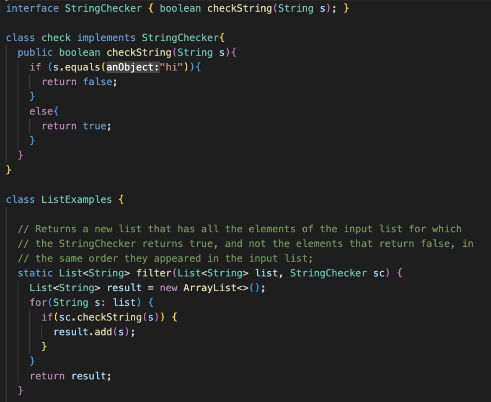

# Lab Report 2

Hello!! Welcome to the second part of the CSE15l journey. Here we are going to learn how to setup a local server and debug different methods!

## StringServer

Here is the code I wrote to create a local server that adds new lines of text each time you enter /add-message?s=<String of your chose>
  

**Screen Shot 1**

  
 The method that was called for this to function was handleRequest
  
  * this worked by the method seeing that the url contained /add
  
  * next it split the url after the = sign and proceeded to make that an object called newMessage
  
  * newMessage includes the string and a new line
  
  * the newMessage is added to an empty string called message
  
  * this is finally returned so we get all of the strings each time we run the url
  
  
**Screen Shot 2**

  
The method that was called for this to function was handleRequest
  
  * this worked by the method seeing that the url contained /add
  
  * next it split the url after the = sign and proceeded to make that an object called newMessage
  
  * newMessage includes the string and a new line
  
  * the newMessage is added to an empty string called message
  
  * this is finally returned so we get all of the strings each time we run the url
  
  ## Debuggin
  
  Below is an error message of code that would conduct the correct choosing of strings, but would put them in the wrong order
  
  MacBook-Pro-157:lab3 GraceConstantian$ java -cp .:lib/hamcrest-core-1.3.jar:lib/junit-4.13.2.jar org.junit.runner.JUnitCore ListTests
JUnit version 4.13.2
.E
Time: 0.016
There was 1 failure:
1) filter(ListTests)
java.lang.AssertionError: expected:<[banana, pear]> but was:<[pear, banana]>
        at org.junit.Assert.fail(Assert.java:89)
        at org.junit.Assert.failNotEquals(Assert.java:835)
        at org.junit.Assert.assertEquals(Assert.java:120)
        at org.junit.Assert.assertEquals(Assert.java:146)
        at ListTests.filter(ListTests.java:12)

FAILURES!!!
Tests run: 1,  Failures: 1

The error is that the two items were switched
  

