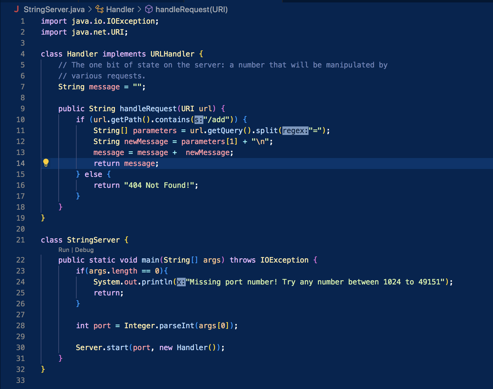
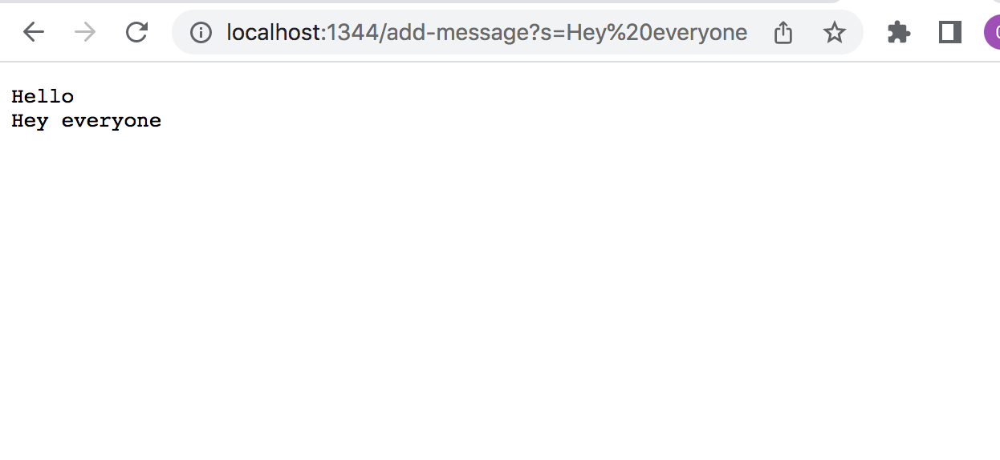
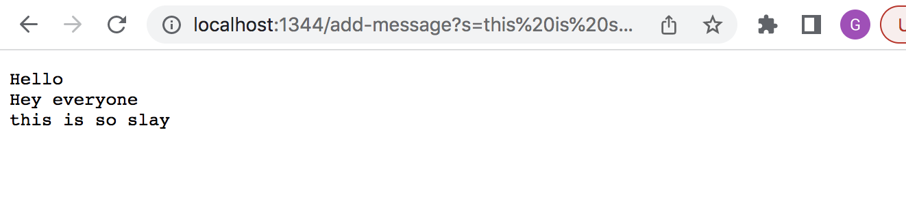

# Lab Report 2

Hello!! Welcome to the second part of the CSE15l journey. Here we are going to learn how to setup a local server and debug different methods!

## StringServer

Here is the code I wrote to create a local server that adds new lines of text each time you enter /add-message?s=<String of your chose>
  

**Screen Shot One**

  
 The method that was called for this to function was handleRequest
  
  * this worked by the method seeing that the url contained /add
  
  * next it split the url after the = sign and proceeded to make that an object called newMessage
  
  * newMessage includes the string and a new line
  
  * the newMessage is added to an empty string called message
  
  * this is finally returned so we get all of the strings each time we run the url

