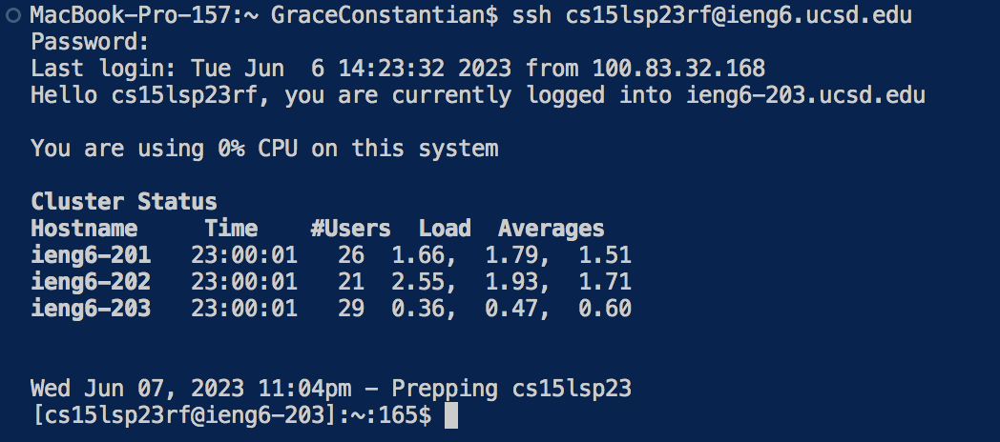
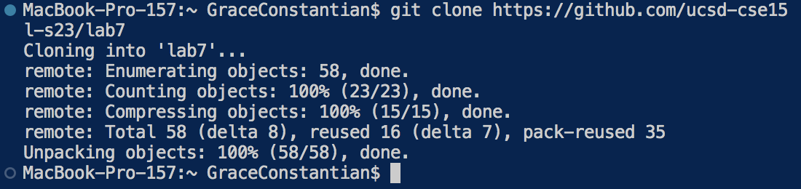
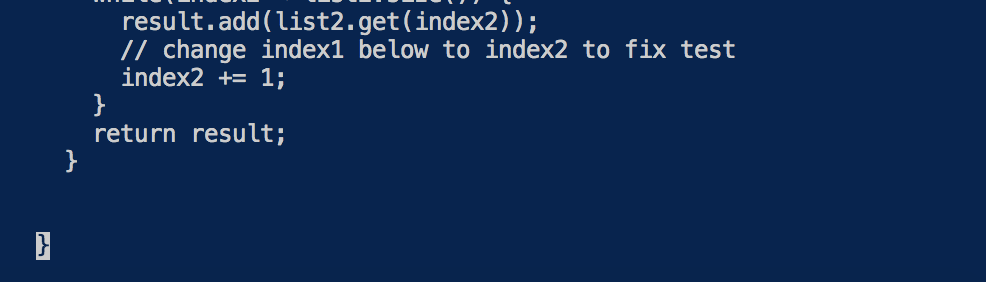
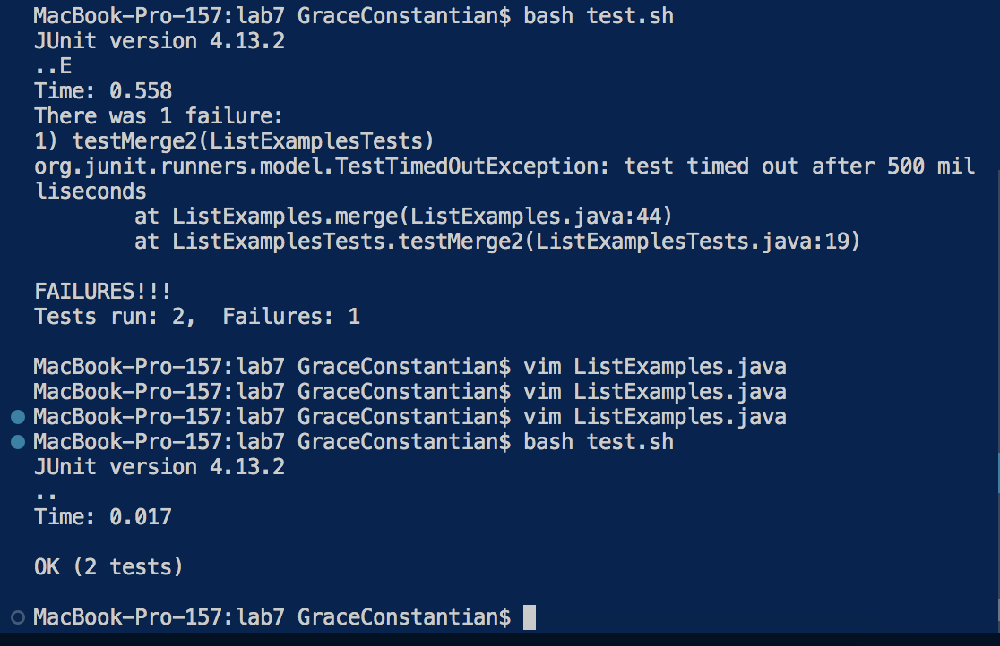
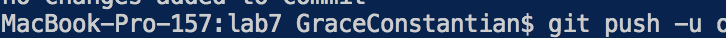
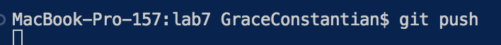

#  Lab Report 4

Hello! Welcome to the fourth part of the CSE15l journey!! 

We will completing the next steps and documenting them below. The steps include

0. Log into ssh account
1. Clone your fork of the repository from your Github account
2. Run the tests, demonstrating that they fail
3. Edit the code file to fix the failing test
4. Run the tests, demonstrating that they now succeed
5. Commit and push the resulting change to your Github account (you can pick any commit message!)

## 0. Log into your ssh account

to do this type
```
ssh cs15lsp23zz@ieng6.ucsd.edu
```
replace the zz with whatever your specific letters are
click enter
then type in your password
click enter


## 1. Clone your fork of the repository from your Github account

To do this type 
```
git clone https://github.com/ucsd-cse15l-s23/lab7
```
in your terminal and click
```
<enter>
```
This will clone your fork into the repository so you can start editing it.


## 2. Run the tests, demonstrating that they fail

to do this type 
``` 
cd lab7
```
in your terminal and click 
```
<enter>
```
then to run the test type
```
bash test.sh
```
in the terminal and click
```
enter
```


## 3. Edit the code file to fix the failing test

to do this type
```
vim ListExamples.java
```
in your terminal and click
```
<enter>
```
then type
```
/index1
```
and then click
```
nnnnnnnn
```
this will bring you to the index1 that is inducing the error
then in this order click
```
e
```
```
x
```
```
i
```
```
2
```
then type 
```
:wq
```
to save and quit


## 4. Run the tests, demonstrating that they now succeed

in your terminal and click 
```
<enter>
```
then to run the test type
```
bash test.sh
```
in the terminal and click
```
enter
```


## 5. Commit and push the resulting change to your Github account (you can pick any commit message!)

in your terminal type 
```
git commit -m 'all done'
```
and click enter 
type in your terminal
```
git push
```
then click enter




