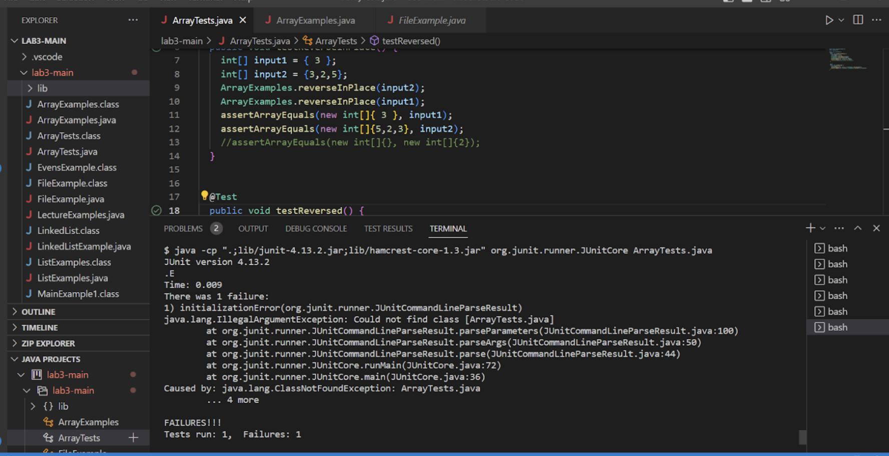

#  Lab Report 4

Hello! Welcome to the final part of your CS15L Journey. It has truly been an interesting quarter.

## Debugging Scenario

**What Environment are you using?**

I am using Visual Studios Code and am using Linux to run my terminal on my Mac computer. I keep getting this Junit error when I try to run my test and I am unsure why.

**Detail the symptoms you are seeing**

The sympots I am seeing is that I have 

**Detail the failure inducing input and context. That might mean any or all the commands you are running, a test case, command line arguments, or working directory**
